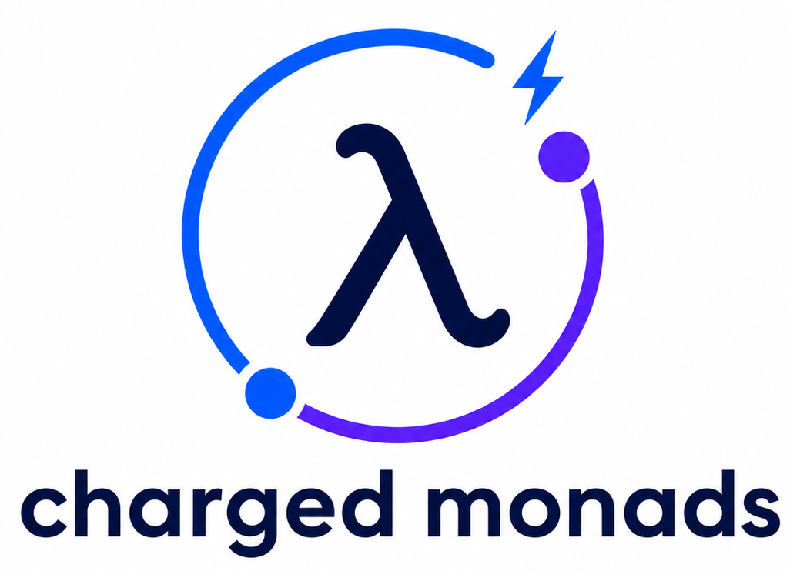

  

Charged Monads provides parameterized monads, which are capable of complex operations that regular monads do not support.

Charged Monads currently includes:
- [ContT](src/contt.ct) - Delimited continuations that are capable of having separate continuation and result types. (Includes a base monad and a monad transformer version.)
- [State](src/state.ct) - A state monad that is capable of changing its state type during the calculation.
- [StateT](src/statet.ct) - A state monad transformer that is capable of changing its state type during the calculation.

See [src/examples.lisp](src/examples.lisp) for usage examples. Running them requires [coalton-io](https://github.com/Jason94/coalton-io).

## Status

Charged Monads is in alpha status. The API will change as more things are added and the ergonomics cleaned up.
